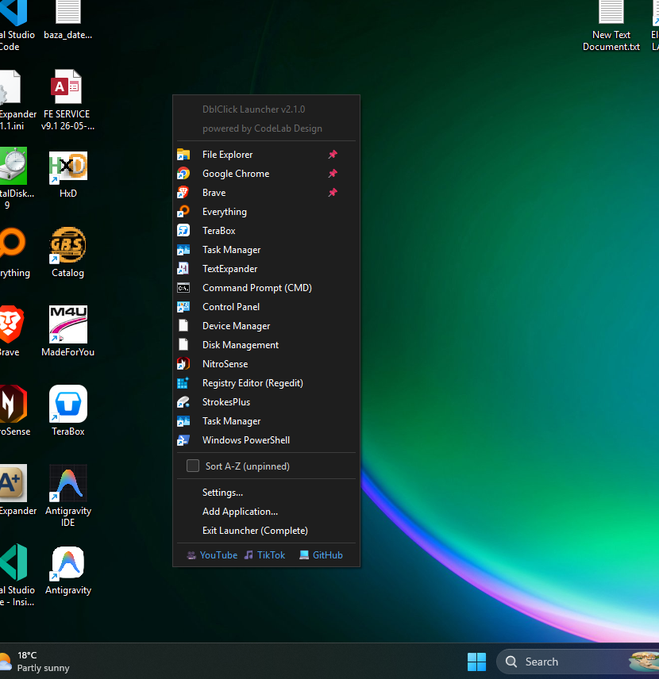
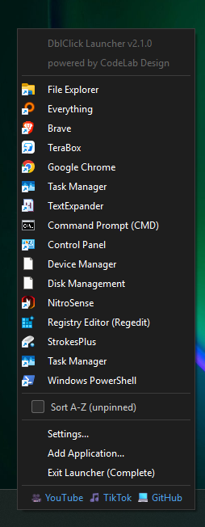
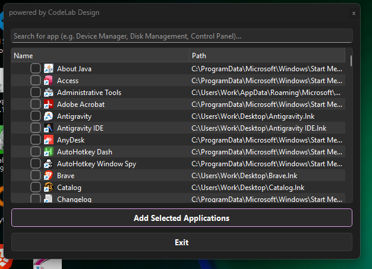
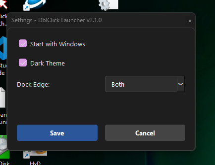
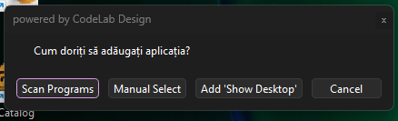

# DblClick Launcher v2.1.0
**Powered by CodeLab Design**

Un utilitar ultra-ușor și intuitiv creat pentru a-ți transforma desktop-ul într-un centru de lansare rapidă. Nu mai căuta prin zeci de iconițe; acum poți accesa aplicațiile preferate cu un simplu dublu-click pe fundal sau atingând marginile ecranului.

### 📸 Galerie Foto / Photo Gallery

### 🚀 Funcții Principale
* **Activare Versatilă:** Dublu-click pe fundalul Desktop-ului sau atingerea marginilor ecranului (stânga, dreapta sau ambele).
* **Organizare Drag-and-Drop:** Trage pictogramele în poziția dorită pentru a personaliza meniul.
* **Management Inteligent:** Sortare alfabetică și funcție "Pin" pentru acces instantaneu la aplicațiile esențiale.
* **Integrare Nativă:** Pornire automată cu Windows-ul (Auto-start).

### 📥 Descărcare și Instalare
Pentru a descărca cea mai recentă versiune, accesează secțiunea **Releases** din partea dreaptă a paginii repository-ului și descarcă fișierul `DblClick-Launcher.exe`.

---

# DblClick Launcher v2.1.0
**Powered by CodeLab Design**

An ultra-lightweight and intuitive utility designed to transform your desktop into a high-speed launchpad. Stop hunting for icons; now you can access your favorite applications with a simple double-click on the wallpaper or by touching the screen edges.

### 🚀 Key Features
* **Versatile Activation:** Double-click on the Desktop wallpaper or touch the screen edges (left, right, or both).
* **Drag-and-Drop Organization:** Simply drag any icon to your preferred position to reorganize your menu.
* **Smart Management:** Alphabetical sorting and "Pin" feature for instant access to your essential apps.
* **Native Integration:** Option for automatic startup with Windows (Auto-start).

### 📥 Download & Installation
To download the latest version, please visit the **Releases** section on the right side of this repository page and download the `DblClick-Launcher.exe` file.

---
*Developed with engineering precision by CodeLab Design.*
